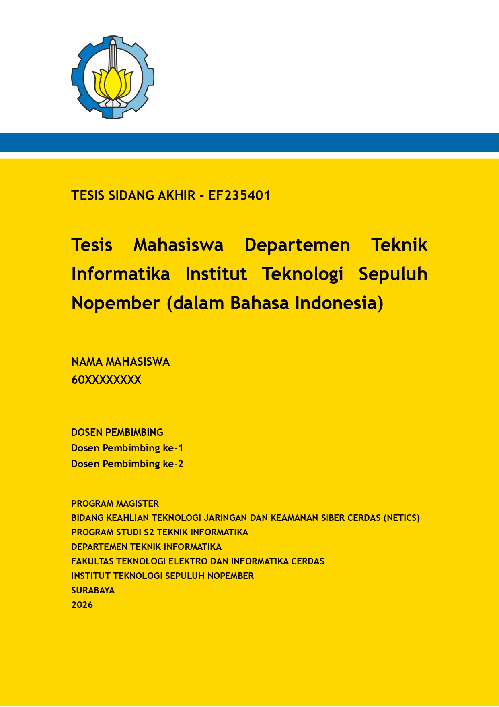
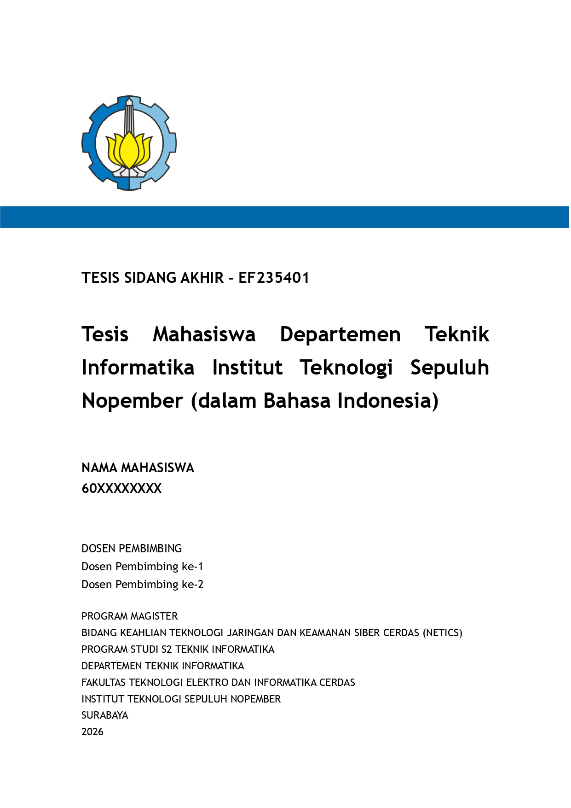
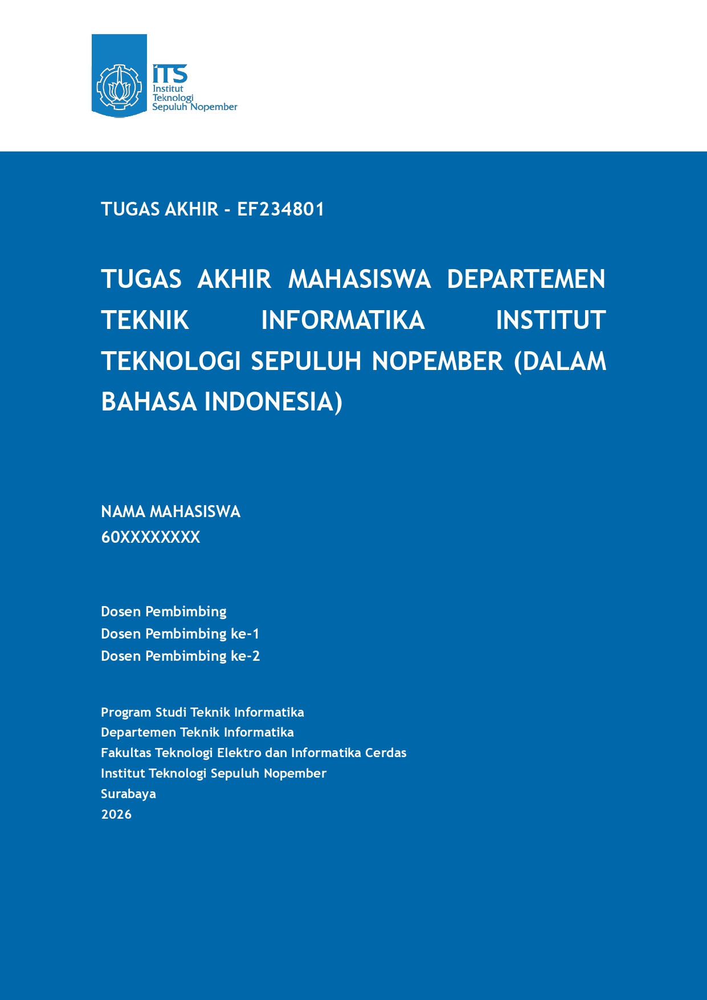
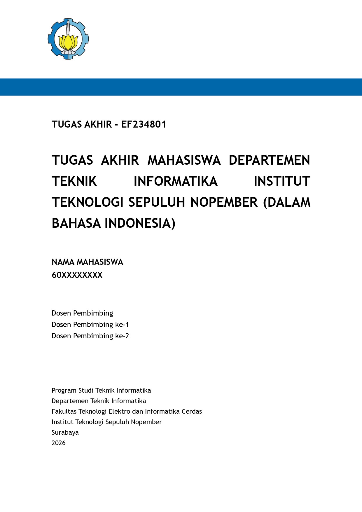

# ITS-IF-THESIS-TYPST

<p align="center">
  <strong>Typst Template for ITS Thesis — Master's & Undergraduate</strong><br>
  <em>Department of Informatics · Faculty of Intelligent Electrical and Informatics Technology</em><br>
  <em>Institut Teknologi Sepuluh Nopember (ITS) · Surabaya, Indonesia</em>
</p>

<p align="center">
  
  
  
</p>

---

## 📖 Overview

[Typst](https://typst.app) is a modern, markup-based typesetting system for the
sciences that serves as a compelling alternative to LaTeX. It combines powerful
scripting capabilities with clean, readable syntax. This template reproduces the
official ITS thesis formatting — for both levels — using Typst's more intuitive
language.

At the **Department of Informatics, Faculty of Intelligent Electrical and
Informatics Technology, Institut Teknologi Sepuluh Nopember (ITS)**, every student
must produce a final academic work:

- **Undergraduate** students → **Tugas Akhir** (Final Project)
- **Master's** students → **Tesis** (Thesis)

This template makes writing those documents easier while still following the ITS
official thesis guidance for both levels.

> Converted from the original LaTeX template by **Ravi Vendra Rishika**.<br>
> Inspired by
> [ravivendra/latex-its-if-thesis-template](https://github.com/ravivendra/latex-its-if-thesis-template).

---

## ✨ Sample Output

<p align="center">
  
  
</p>
<p align="center">
  <em>Master's Thesis (Tesis)</em>
</p>

<p align="center">
  
  
</p>
<p align="center">
  <em>Undergraduate Thesis (Tugas Akhir)</em>
</p>

---

## 🚀 Getting Started

### Prerequisites

- [Typst](https://typst.app) installed locally, **or**
- Use the [Typst web app](https://typst.app) directly in your browser.

### How to Compile

```bash
# ── Master's Thesis ──────────────────────────────────
make master
# or manually
typst compile src/master-thesis/thesis.typ build/master-thesis.pdf
# live preview
typst watch src/master-thesis/thesis.typ build/master-thesis.pdf

# ── Undergraduate Thesis (Tugas Akhir) ──────────────
make undergraduate
# or manually
typst compile src/undergraduate-thesis/thesis.typ build/undergraduate-thesis.pdf
# live preview
typst watch src/undergraduate-thesis/thesis.typ build/undergraduate-thesis.pdf
```

---

## 📁 File Structure

Two independent template directories live under `src/`. Each is a self-contained
thesis project with its own configuration, template, content, and resources.

```
├── src/
│   ├── master-thesis/             # Master's degree thesis template
│   │   ├── thesis.typ             # Entry point + configuration
│   │   ├── template.typ           # Layout and styling
│   │   ├── content.typ            # Thesis chapters content
│   │   ├── bibliography.bib       # Bibliography database (BibTeX)
│   │   └── resources/             # Image resources
│   │       ├── its-logo.png
│   │       ├── its-thesis-cover-without-logo.svg
│   │       ├── its-thesis-cover-without-logo-2.svg
│   │       ├── its-thesis-validation.png
│   │       ├── fake-sign.svg
│   │       └── chapter-2-power-digital-finance.png
│   │
│   └── undergraduate-thesis/      # Undergraduate thesis (Tugas Akhir) template
│       ├── thesis.typ             # Entry point + configuration
│       ├── template.typ           # Layout and styling
│       ├── content.typ            # Thesis chapters content
│       ├── bibliography.bib       # Bibliography database (BibTeX)
│       └── resources/             # Image resources
│           ├── its-logo.png
│           ├── its-thesis-cover-without-logo.svg
│           ├── its-thesis-cover-without-logo-2.svg
│           ├── fake-sign.svg
│           └── chapter-2-power-digital-finance.png
│
├── samples/                # Sample rendered pages (JPG)
├── build/                  # Build output directory
│   ├── master-thesis.pdf
│   └── undergraduate-thesis.pdf
├── Makefile                # Build automation
└── LICENSE
```

---

## 🎨 Customization

Each thesis type has its own independent configuration. Edit the variables at the
top of the respective `thesis.typ` file:

- **Master's**: [`src/master-thesis/thesis.typ`](src/master-thesis/thesis.typ)
- **Undergraduate**: [`src/undergraduate-thesis/thesis.typ`](src/undergraduate-thesis/thesis.typ)

All metadata is defined as plain Typst variables — no separate `yaml` file needed.

### Basic Information

```typst
// --- Author Information ---
#let author = "Nama Mahasiswa"
#let nrp = "60xxxxxxxx"
#let sign = "resources/fake-sign.svg"          // Signature image for documents

// --- Thesis Titles ---
#let title = (
  id: "Judul Tesis/Tugas Akhir ... (dalam Bahasa Indonesia)",
  en: "Thesis/Final Project Title ... (in English)",
)
```

### Supervisors, Examiners & Head of Department

Each person entry includes a `sign` field pointing to their signature image (SVG/PNG):

```typst
// --- Supervisor Information ---
#let supervisors = (
  (name: "Dosen Pembimbing ke-1", nip: "20xxxxxxxx", sign: "resources/fake-sign.svg"),
  (name: "Dosen Pembimbing ke-2", nip: "20xxxxxxxx", sign: "resources/fake-sign.svg"),
)

// --- Examiner Information ---
#let examiners = (
  (name: "Dosen Penguji ke-1", nip: "20xxxxxxxx", sign: "resources/fake-sign.svg"),
  (name: "Dosen Penguji ke-2", nip: "20xxxxxxxx", sign: "resources/fake-sign.svg"),
  (name: "Dosen Penguji ke-3", nip: "20xxxxxxxx", sign: "resources/fake-sign.svg"),
)

// --- Head of Department ---
#let chief = (name: "Nama Kepala Departemen", nip: "20xxxxxxxx", sign: "resources/fake-sign.svg")
```

### Dates

```typst
// --- Dates (Master's) ---
#let dates = (
  writing: "27 Juni 2024",
  exam: (day: "Rabu", date: "10 Juli 2024", place: "Ruang 217B"),
  graduationPeriod: "September 2024",
)

// --- Dates (Undergraduate) ---
#let dates = (
  writing: "27 Juni 2024",
  exam: (day: "Rabu", date: "10 Juli 2024", place: "Ruang 217B"),
  writingPeriod: "September 2024",
)
```

### Academic Program

**Master's** uses a single `program` dictionary with additional fields for concentration and course class:

```typst
// --- Master's ---
#let program = (
  type: "Program Magister",
  title: "Magister Komputer (M.Kom.)",
  concentration: "Teknik Informatika",
  courseClass: "Teknologi Jaringan dan Keamanan Siber Cerdas",
  courseClassShort: "NETICS",
  degree: "S2",
  department: "Departemen Teknik Informatika",
  faculty: "Fakultas Teknologi Elektro dan Informatika Cerdas",
  university: "Institut Teknologi Sepuluh Nopember",
  city: "Surabaya",
  year: 2026,
)
```

**Undergraduate** has separate `program` (Indonesian) and `program-en` (English) dictionaries:

```typst
// --- Undergraduate (Indonesian) ---
#let program = (
  title: "Sarjana Komputer (S.Kom.)",
  degree: "S1",
  concentration: "Teknik Informatika",
  department: "Departemen Teknik Informatika",
  faculty: "Fakultas Teknologi Elektro dan Informatika Cerdas",
  university: "Institut Teknologi Sepuluh Nopember",
  city: "Surabaya",
  year: 2026,
)

// --- Undergraduate (English) ---
#let program-en = (
  title: "Bachelor of Computer Science (B.Comp.Sc.)",
  degree: "S1",
  concentration: "Informatics Engineering",
  department: "Department of Informatics Engineering",
  faculty: "Faculty of Intelligent Electrical and Informatics Technology",
  university: "Sepuluh Nopember Institute of Technology",
  city: "Surabaya",
  year: 2026,
)
```

### Essay Code & Resource Paths

**Master's** uses a plain string for the essay code and includes a validation background image:

```typst
// --- Essay Code (Master's) ---
#let essay = "Tesis Sidang Akhir - EF235401"

// --- Resource Paths (Master's) ---
#let paths = (
  logo: "resources/its-logo.png",
  coverBackground: "resources/its-thesis-cover-without-logo.svg",
  coverBackgroundSecondary: "resources/its-thesis-cover-without-logo-2.svg",
  validationBackground: "resources/its-thesis-validation.png",
  bibliography: "bibliography.bib",
)
```

**Undergraduate** uses a dictionary for essay code with both Indonesian and English labels:

```typst
// --- Essay Code (Undergraduate) ---
#let essay = (
  id: "Tugas Akhir - EF234801",
  en: "Final Project - EF234801",
)

// --- Resource Paths (Undergraduate) ---
#let paths = (
  logo: "resources/its-logo.png",
  coverBackground: "resources/its-thesis-cover-without-logo.svg",
  coverBackgroundSecondary: "resources/its-thesis-cover-without-logo-2.svg",
  bibliography: "bibliography.bib",
)
```

### Template Flags

**Master's** — applied at the bottom of [`src/master-thesis/thesis.typ`](src/master-thesis/thesis.typ):

```typst
#show: thesis.with(
  author: author, nrp: nrp, sign: sign,
  supervisors: supervisors,
  examiners: examiners,
  chief: chief,
  dates: dates,
  program: program,
  essay: essay,
  title: title,
  paths: paths,
  proposal: true,   // true  → proposal approval layout
                     // false → final thesis approval + originality statement
)
```

- **`proposal: true`** — renders the *Proposal Tesis* approval page (for seminar).
- **`proposal: false`** — renders the final *Lembar Pengesahan Tesis* page followed by the *Pernyataan Orisinalitas* statement.

**Undergraduate** — applied at the bottom of [`src/undergraduate-thesis/thesis.typ`](src/undergraduate-thesis/thesis.typ) and includes `program-en`:

```typst
#show: thesis.with(
  author: author, nrp: nrp, sign: sign,
  supervisors: supervisors,
  examiners: examiners,
  chief: chief,
  dates: dates,
  program: program,
  program-en: program-en,
  essay: essay,
  title: title,
  paths: paths,
)
```

### Helper: Horizontal Tab Alignment

Both templates provide a `tab-to` helper for aligning text labels across multiple lines (used in abstracts and approval pages):

```typst
#let tab-to(target-width, body) = context {
  let current-width = measure(body).width
  if current-width < target-width {
    h(target-width - current-width)
  } else {
    h(0pt)
  }
}
```

Use it to create aligned label–value pairs:

```typst
Nama#tab-to(3.5cm, [Nama]): #author \
NRP#tab-to(3.5cm, [NRP]): #nrp
```

---

## 🔧 Makefile Targets

```bash
make master               # Build master's thesis PDF
make undergraduate        # Build undergraduate thesis PDF
make watch-master         # Watch mode for master's thesis (live preview)
make watch-undergraduate  # Watch mode for undergraduate thesis (live preview)
make clean                # Remove build artifacts
make help                 # Show available targets
```

---

## 👤 Author

**Muhammad 'Arif Faizin** <ariffaizin@its.ac.id>

For questions or suggestions to improve this template, feel free to reach out via
the email above.

---

## 📄 License

Released under the **GNU GPL v3.0** — a free, copyleft license for software and
other kinds of works. See the [`LICENSE`](LICENSE) file for details.
